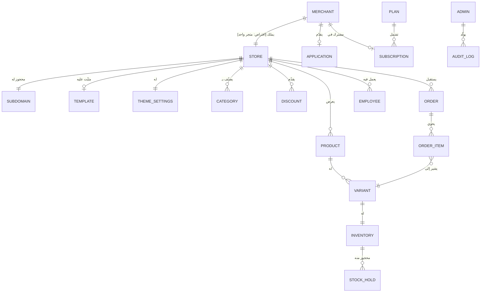

# نموذج المنتج — منصة توا

> **مصدر الحقيقة:** `docs/requirements/توا-المتطلبات.pdf` (المتطلبات الوظيفية) مع الاستئناس بـ `docs/requirements/تحليل-وبرومتات-التصميم.md`.
> كل ما لم يرد نصاً في المتطلبات موسوم صراحة بـ **[افتراض]** أو **[سؤال مفتوح]** أو **[توصية]**.

> **ملاحظة ترقيم:** وثيقة المتطلبات تستخدم الترقيم `1.3.x` مرتين: لوحدة «المظهر والقوالب» عند التاجر، ولوحدة «مراجعة الاعتماد» عند مدير المنصة. في وثائق UX نكتب بنود المدير بصيغة **م.1.3.x** للتمييز.

---

## 1. الغرض والقيمة المقترحة

**توا** منصة تجارة إلكترونية متعددة التجار (Multi-vendor SaaS): يُنشئ التاجر متجراً إلكترونياً خاصاً به على نطاق فرعي مستقل (مثل `mystore.tawa.ly` — الصيغة من وثيقة التحليل)، ويديره من لوحة تحكم، بينما يتسوق الزبون من واجهة المتجر مباشرة دون حساب، وتشرف إدارة المنصة على الجودة والاعتماد والاشتراكات.

| المستفيد | القيمة |
|---|---|
| التاجر | إطلاق متجر إلكتروني جاهز دون تطوير تقني: منتجات ومتغيرات ومخزون وطلبات وخصومات وفريق عمل ومظهر قابل للتخصيص |
| الزبون | تسوق سريع بالعربية، سلة وشراء دون إنشاء حساب، وتتبع الطلب برقم مرجعي + رقم الهاتف (2.2.8) |
| مدير المنصة | ضبط جودة المتاجر والمنتجات عبر الاعتماد والرقابة، وإدارة الإيراد عبر باقات الاشتراك |

**[افتراض]** نموذج الإيراد الوحيد المذكور في المتطلبات هو باقات الاشتراك الشهرية (م.1.3.10 – م.1.3.12)؛ لا يوجد ذكر لعمولة على المبيعات.

---

## 2. الأدوار الثلاثة وأهدافها

### 2.1 التاجر (Merchant)
صاحب المتجر. أهدافه:
- إنشاء حساب وتفعيله بـ OTP والانضمام للمنصة (1.1.1 – 1.1.2)
- تجهيز متجره: الاسم، اللغة، النطاق الفرعي، القالب، الألوان، ترتيب الأقسام (1.2.1، 1.3.1 – 1.3.5)
- إدارة الكتالوج: منتجات، متغيرات، مخزون، أرشفة (1.4.x)
- إدارة الطلبات عبر دورة حياتها وإلغاؤها عند الحاجة (1.5.2 – 1.5.5)
- تحفيز المبيعات بالخصومات (1.5.1)
- توسيع العمل بفريق موظفين بصلاحيات محددة (1.5.7 – 1.5.9)

**دور فرعي — الموظف (Employee):** عضو فريق يدعوه التاجر بالبريد، يصل إلى وظائف لوحة التحكم المسموح بها فقط (1.5.7 – 1.5.8). **[افتراض]** الموظف يعمل داخل متجر تاجرٍ واحد ولا يملك صلاحيات مالية أو إدارية على مستوى الحساب ما لم تُمنح له.

### 2.2 الزبون (Customer)
مشترٍ نهائي يزور واجهة متجر معيّن. أهدافه:
- تصفح المنتجات المنشورة والبحث والتصفية (2.1.1 – 2.1.4)
- فهم المنتج واختيار المتغير المناسب (2.1.5)
- الشراء: سلة → بيانات شحن → دفع (كاش عند الاستلام أو بطاقة مصرفية) → رقم تتبع (2.2.1 – 2.2.7)
- تتبع طلبه لاحقاً برقم الطلب + رقم الهاتف **دون تسجيل حساب** (2.2.8)

**نقطة جوهرية:** المتطلبات لا تتضمن أي حساب للزبون — كامل رحلة الشراء والتتبع تعمل كضيف (Guest checkout).

### 2.3 مدير المنصة (Platform Administrator)
مشغّل المنصة. أهدافه:
- مراجعة طلبات انضمام التجار ووثائقهم، والاعتماد أو الرفض مع سبب (م.1.3.1 – م.1.3.3)
- ضبط الجودة: حظر/تعليق تاجر وفكه، معاينة المتاجر، فحص المنتجات عبر المنصة، حظر منتج مخالف مع إشعار التاجر بالدليل (م.1.3.4 – م.1.3.9)
- إدارة باقات الاشتراك: إنشاء، تعديل، أرشفة، وتجديد يدوي بعد السداد (م.1.3.10 – م.1.3.12)
- مراجعة سجل التدقيق للعمليات الحساسة — قراءة فقط (م.1.3.13)

---

## 3. حدود الأدوار

| القدرة | التاجر | الموظف | الزبون | مدير المنصة |
|---|---|---|---|---|
| إنشاء/تعديل منتجات ومخزون متجره | ✅ | حسب الصلاحية | ❌ | ❌ (لا يحرر؛ يحظر فقط) |
| نشر/إلغاء نشر المتجر | ✅ (بعد الاعتماد) | حسب الصلاحية | ❌ | ❌ (لكن يعلّق المتجر بالحظر) |
| إدارة طلبات المتجر | ✅ | حسب الصلاحية | ❌ | ❌ |
| الشراء والتتبع | — | — | ✅ (دون حساب) | — |
| اعتماد/رفض التجار | ❌ | ❌ | ❌ | ✅ |
| حظر تاجر/منتج | ❌ | ❌ | ❌ | ✅ |
| إدارة باقات الاشتراك والتجديد | ❌ (يشترك فقط) | ❌ | ❌ | ✅ |
| الاطلاع على سجل التدقيق | ❌ | ❌ | ❌ | ✅ (قراءة فقط) |
| رؤية متاجر تجار آخرين من الداخل | ❌ | ❌ | — | ✅ (معاينة ورقابة) |
| دعوة موظفين وتحديد صلاحياتهم وتعطيلهم | ✅ | ❌ **[افتراض]** | ❌ | ❌ |

**[افتراض]** الموظف لا يستطيع إدارة الموظفين الآخرين. المتطلبات لا تحدد قائمة الصلاحيات القابلة للمنح؛ وثيقة التحليل تقترح مفاتيح على مستوى الوحدات (طلبات، منتجات، مخزون، خصومات، مظهر، إعدادات، فريق) — تُعامل كتوصية.

**[سؤال مفتوح]** هل يستطيع مدير المنصة الدخول إلى لوحة تحكم التاجر نفسها (Impersonation) أم يكتفي بمعاينة واجهة المتجر العامة؟ المتطلبات تذكر «معاينة متجر معين» فقط (م.1.3.7).

---

## 4. الكيانات الأساسية وعلاقاتها

### 4.1 الكيانات

| الكيان | أهم الحقول المستنتجة من المتطلبات | المرجع |
|---|---|---|
| **التاجر** Merchant | الاسم، البريد، الهاتف، كلمة المرور، حالة توثيق الحساب | 1.1.1، 1.1.6 |
| **طلب الانضمام** Merchant Application | التاجر، الوثائق المرفوعة، الحالة (بانتظار/معتمد/مرفوض)، سبب الرفض | م.1.3.1 – م.1.3.3 |
| **المتجر** Store | الاسم، الشعار، اللغة، البيانات التعريفية، الحالة (منشور/غير منشور/صيانة/معلّق)، السياسات الإلزامية | 1.2.x |
| **النطاق الفرعي** Subdomain | معرّف فريد يُحجز فور التسجيل | 1.2.1 |
| **القالب** Template | تصميم معتمد، عربي RTL، متجاوب | 1.3.1 – 1.3.2 |
| **إعدادات المظهر** Theme Settings | ألوان رئيسية/ثانوية، خلفيات الهيدر والفوتر، ترتيب/إظهار أقسام الواجهة | 1.3.3 – 1.3.4 |
| **الفئة/التصنيف** Category | تصنيف رئيسي وفرعي للمنتجات | 1.4.1، 2.1.3 |
| **المنتج** Product | الاسم، الوصف، الفئة، الصور، السعر، الحالة (منشور/مسودة **[افتراض]**/مؤرشف/محظور) | 1.4.x |
| **المتغير** Variant | تركيبة خيارات (مقاس × لون)، سعر ومخزون وصورة مستقلة، SKU **[افتراض من وثيقة التحليل]** | 1.4.6 – 1.4.8 |
| **المخزون** Inventory | الكمية، المحجوز مؤقتاً، الصافي المتاح، حد التنبيه | 1.4.9 – 1.4.12 |
| **حجز المخزون** Stock Hold | كمية مقفلة 15 دقيقة أثناء الشراء | 1.4.11 |
| **الخصم** Discount | مبلغ ثابت، فترة سريان، حد أدنى للطلب | 1.5.1 |
| **الطلب** Order | رقم تتبع فريد، العناصر، بيانات الزبون (اسم/هاتف/عنوان/مكان استلام)، رسوم شحن، طريقة دفع، حالات (طلب/دفع/توصيل) | 1.5.2 – 1.5.5، 2.2.x |
| **عنصر الطلب** Order Item | منتج/متغير، كمية، سعر وحدة | 1.5.3 |
| **الموظف** Employee | بريد، دور/صلاحيات، حالة (بانتظار قبول الدعوة **[افتراض]**/نشط/معطّل) | 1.5.7 – 1.5.9 |
| **باقة الاشتراك** Plan | الاسم، السعر، حدود الخدمات، حالة (نشطة/مؤرشفة) | م.1.3.10 – م.1.3.11 |
| **اشتراك التاجر** Subscription | التاجر، الباقة، تاريخ الانتهاء، تجديد يدوي | م.1.3.12 |
| **سجل التدقيق** Audit Log | العملية الحساسة، المنفّذ، الطابع الزمني | م.1.3.13 |
| **مخالفة/حظر منتج** Product Violation | المنتج، السبب/الدليل، إشعار التاجر | م.1.3.9 |

### 4.2 العلاقات

**[افتراض]** علاقة التاجر بالمتجر 1:1 — المتطلبات تتحدث دائماً عن «متجره» بالمفرد ويُحجز النطاق فور التسجيل (1.2.1). يجب تأكيدها لأن تعددية المتاجر تقلب بنية الملاحة رأساً على عقب.

**[افتراض]** المنتج بلا متغيرات يُمثَّل داخلياً بمتغير افتراضي واحد (لتوحيد المخزون والتسعير)، فالمتطلبات تسند السعر للمنتج (1.4.3) وللمتغير (1.4.7) معاً.

**[سؤال مفتوح]** هل التصنيفات مركزية على مستوى المنصة (يديرها المدير) أم خاصة بكل متجر؟ المتطلبات تذكر «تصنيف فرعي أو رئيسي» (2.1.3) دون تحديد الجهة المالكة.

---

## 5. قواعد المنتج والقيود الأهم

1. **التفعيل قبل كل شيء:** لا حساب تاجر فاعلاً دون تأكيد ملكية الهاتف بـ OTP، ويُعاد الطلب عند تغيير الرقم (1.1.2، 1.1.7).
2. **الاعتماد قبل النشر:** المتجر لا يُنشر للعامة إلا بعد اعتماد الإدارة لحساب التاجر (م.1.3.2) واستيفاء متطلبات النشر: منتجات + السياسات الإلزامية (1.2.4). **[افتراض من وثيقة التحليل]** الحد الأدنى منتج واحد.
3. **إلغاء النشر لا يوقف الإدارة:** الزوار يرون صفحة صيانة، والطلبات السابقة تبقى قابلة للإدارة (1.2.5).
4. **الأرشفة بدل الحذف:** المنتج المؤرشف يُخفى مع الحفاظ على سجلاته لمنع كسر الطلبات القديمة (1.4.5). المتطلبات لا تنص على حذف نهائي للمنتج إطلاقاً.
5. **حجز المخزون 15 دقيقة:** الكميات المطلوبة تُقفل أثناء الشراء لمنع البيع الزائد؛ المتاح للبيع = الكمية − المحجوز (1.4.9، 1.4.11).
6. **الإلغاء يعيد المخزون آلياً:** إلغاء الطلب يُرجع الكميات المخصومة للمخزن تلقائياً (1.5.5).
7. **مسار حالة الطلب خطي:** مؤكد → قيد التجهيز → جاهز للتسليم → مسلّم (1.5.4)، مع الإلغاء كحالة خارجة. **[سؤال مفتوح]** هل يُسمح بالرجوع للخلف بين الحالات؟ ومن أي الحالات يجوز الإلغاء؟
8. **رقم تتبع فريد لكل طلب** يمنع التكرار، وهو مفتاح التتبع مع رقم الهاتف دون حساب (2.2.6، 2.2.8).
9. **الرفض مسبَّب دائماً:** رفض توثيق التاجر يتطلب سبباً ليتمكن من إعادة التقديم (م.1.3.3)، وحظر المنتج يُشعر التاجر بالدليل (م.1.3.9).
10. **أرشفة الباقة لا تمس المشتركين:** تمنع التقديم الجديد فقط مع بقاء المشتركين الحاليين (م.1.3.11ب).
11. **سجل التدقيق للقراءة فقط** ويغطي العمليات الحساسة فقط (م.1.3.13).
12. **حدود الباقة تقيّد التاجر:** لكل باقة «حدود خدمات» (م.1.3.10). **[سؤال مفتوح]** ما الحدود بالضبط وما سلوك النظام عند تجاوزها أو انتهاء الاشتراك؟ (وثيقة التحليل تقترح: عدد منتجات، عدد موظفين، نطاق مخصص — توصية غير ملزمة.)
13. **الدفع:** كاش عند الاستلام أو بطاقة مصرفية عبر «شاشة معاملات» (2.2.7). **[سؤال مفتوح]** بوابة الدفع، وسلوك فشل الدفع، والاسترجاع غير محددة.
14. **لغة المتجر** قابلة للضبط (عربي/إنجليزي بحسب وثيقة التحليل) (1.2.1، 1.5.6). **[سؤال مفتوح]** هل تشمل ازدواجية محتوى المنتجات أم واجهة العرض فقط؟

---

## 6. ملخص الافتراضات والأسئلة غير المُجابة

### افتراضات معتمدة في هذه الوثائق (تحتاج تصديق مالك المنتج)
| # | الافتراض | الأثر لو خالف الواقع |
|---|---|---|
| ~~A1~~ | ~~تاجر واحد = متجر واحد~~ — ❌ **منقوض بمخطط الباكند (17 أغسطس 2026)**: التاجر يملك متاجر متعددة، والواجهة تعمل بمفهوم «المتجر النشط» (D5 في سجل قرارات التصميم) | تحقّق الأثر: أُضيف مبدّل متاجر وسياق نشط لكل شاشات التاجر |
| A2 | لا حسابات للزبائن نهائياً (ضيف فقط) | يضيف مساراً كاملاً (تسجيل، عناوين محفوظة، سجل طلبات) |
| A3 | العملة الوحيدة الدينار الليبي (من وثيقة التحليل فقط) | حقول عملة وتنسيقات جديدة |
| A4 | المنتج بلا متغيرات = متغير افتراضي واحد | يغيّر نماذج الإدخال والمخزون |
| A5 | الموظف يتبع متجراً واحداً ولا يدير الفريق | يغيّر نموذج الصلاحيات |
| A6 | الحد الأدنى للنشر: منتج واحد + سياسات | يغيّر Checklist النشر |

### أهم الأسئلة المفتوحة (التفصيل الكامل في `requirements-gap-analysis.md`)
1. من يحدد رسوم الشحن وكيف تُحسب؟ (تظهر في تفاصيل الطلب 1.5.3 دون مصدر)
2. ما بوابة الدفع بالبطاقة وما سلوك الفشل/الاسترجاع؟
3. ما قائمة الصلاحيات القابلة للمنح للموظفين تحديداً؟
4. ما «السياسات الإلزامية» المطلوبة للنشر بالضبط؟
5. ما حدود الباقات وسلوك النظام عند التجاوز/الانتهاء؟
6. هل التصنيفات مركزية أم لكل متجر؟
7. قنوات الإشعارات (تنبيه انخفاض المخزون 1.4.12، إشعار الحظر م.1.3.9): داخل اللوحة؟ بريد؟ SMS؟
